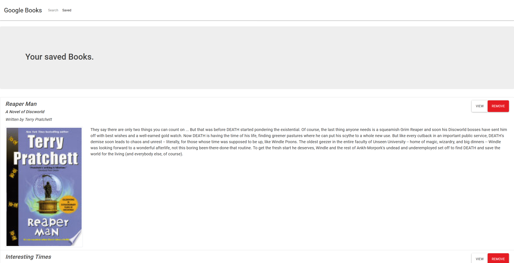

# googleBookSearch

* Author: Erik Schaal

## This is a react app that allows the user to search the google books api, and save them to a mongoDB database.

## link

* you can find a link to the deployed application here. 

https://vast-journey-44306.herokuapp.com/